# Al-Arabi Platform - Entity Relationship Diagram

## Database Schema Overview

The Al-Arabi platform uses PostgreSQL as the primary database with PostGIS extension for location-based services. The schema is designed to support multi-language content (Arabic/English) and complex business relationships.

## Entity Relationship Diagram

```mermaid
erDiagram
    users ||--o{ events : organizes
    users ||--o{ orders : places
    users ||--o{ contracts : signs
    users ||--o{ notifications : receives
    users ||--o{ purchased_tickets : owns
    
    venues ||--o{ events : hosts
    
    events ||--o{ tickets : contains
    events ||--o{ orders : generates
    events ||--o{ contracts : requires
    events ||--o{ event_analytics : tracks
    
    tickets ||--o{ order_items : includes
    tickets ||--o{ purchased_tickets : creates
    
    orders ||--o{ order_items : contains
    orders ||--o{ payment_transactions : processes
    orders ||--o{ purchased_tickets : generates
    
    order_items ||--o{ purchased_tickets : produces
    
    contracts ||--o{ events : governs
    
    otp_codes }|--|| users : verifies
    
    users {
        uuid id PK
        varchar email UK
        varchar phone UK
        varchar password_hash
        varchar first_name
        varchar last_name
        varchar first_name_ar
        varchar last_name_ar
        date date_of_birth
        varchar gender
        varchar preferred_language
        text profile_image_url
        boolean is_verified
        boolean is_active
        varchar role
        timestamp created_at
        timestamp updated_at
        timestamp last_login_at
    }
    
    venues {
        uuid id PK
        varchar name
        varchar name_ar
        text description
        text description_ar
        text address
        text address_ar
        varchar city
        varchar city_ar
        varchar country
        varchar country_ar
        varchar postal_code
        decimal latitude
        decimal longitude
        geography location
        integer capacity
        jsonb amenities
        jsonb images
        jsonb contact_info
        boolean is_active
        timestamp created_at
        timestamp updated_at
    }
    
    events {
        uuid id PK
        varchar title
        varchar title_ar
        text description
        text description_ar
        varchar category
        uuid venue_id FK
        uuid organizer_id FK
        timestamp start_date
        timestamp end_date
        varchar timezone
        varchar status
        varchar visibility
        integer max_attendees
        integer min_age
        varchar dress_code
        varchar dress_code_ar
        jsonb images
        text_array tags
        text_array tags_ar
        jsonb metadata
        varchar pricing_strategy
        decimal base_price
        varchar currency
        decimal commission_rate
        text refund_policy
        text refund_policy_ar
        text terms_conditions
        text terms_conditions_ar
        boolean is_featured
        timestamp created_at
        timestamp updated_at
    }
    
    tickets {
        uuid id PK
        uuid event_id FK
        varchar name
        varchar name_ar
        text description
        text description_ar
        decimal price
        varchar currency
        integer quantity_available
        integer quantity_sold
        timestamp sale_start_date
        timestamp sale_end_date
        varchar ticket_type
        jsonb benefits
        jsonb restrictions
        boolean is_transferable
        boolean is_refundable
        integer max_per_order
        timestamp created_at
        timestamp updated_at
    }
    
    orders {
        uuid id PK
        varchar order_number UK
        uuid user_id FK
        uuid event_id FK
        varchar status
        decimal subtotal
        decimal tax_amount
        decimal service_fee
        decimal total_amount
        varchar currency
        varchar payment_method
        varchar payment_gateway
        varchar payment_id
        varchar payment_status
        jsonb billing_info
        text notes
        timestamp created_at
        timestamp updated_at
        timestamp expires_at
    }
    
    order_items {
        uuid id PK
        uuid order_id FK
        uuid ticket_id FK
        integer quantity
        decimal unit_price
        decimal total_price
        timestamp created_at
    }
    
    purchased_tickets {
        uuid id PK
        uuid order_item_id FK
        uuid ticket_id FK
        varchar holder_name
        varchar holder_email
        varchar holder_phone
        varchar qr_code UK
        varchar status
        timestamp used_at
        uuid checked_in_by FK
        timestamp created_at
        timestamp updated_at
    }
    
    contracts {
        uuid id PK
        uuid organizer_id FK
        uuid event_id FK
        varchar contract_type
        text pdf_path
        varchar pdf_hash
        varchar status
        timestamp organizer_signed_at
        text organizer_signature
        timestamp platform_signed_at
        text platform_signature
        jsonb terms
        decimal commission_rate
        timestamp created_at
        timestamp updated_at
    }
    
    otp_codes {
        uuid id PK
        varchar phone
        varchar code
        varchar purpose
        timestamp expires_at
        timestamp used_at
        integer attempts
        timestamp created_at
    }
    
    notifications {
        uuid id PK
        uuid user_id FK
        varchar type
        varchar title
        varchar title_ar
        text message
        text message_ar
        jsonb data
        boolean is_read
        varchar sent_via
        timestamp created_at
    }
    
    payment_transactions {
        uuid id PK
        uuid order_id FK
        varchar gateway
        varchar gateway_transaction_id
        decimal amount
        varchar currency
        varchar status
        jsonb gateway_response
        timestamp created_at
        timestamp updated_at
    }
    
    event_analytics {
        uuid id PK
        uuid event_id FK
        varchar metric_name
        decimal metric_value
        jsonb dimensions
        timestamp recorded_at
    }
```

## Table Descriptions

### Core Entities

#### 1. Users
- **Purpose**: Store user account information
- **Key Features**: 
  - Multi-language name support (Arabic/English)
  - Role-based access control
  - Phone-based authentication
  - Profile customization

#### 2. Venues
- **Purpose**: Store event venue information
- **Key Features**:
  - Geographic location with PostGIS
  - Multi-language descriptions
  - Capacity and amenities tracking
  - Image galleries

#### 3. Events
- **Purpose**: Central entity for event management
- **Key Features**:
  - Multi-language event details
  - Flexible pricing strategies
  - Category-based organization
  - Rich metadata support

#### 4. Tickets
- **Purpose**: Define ticket types for events
- **Key Features**:
  - Multiple ticket types per event
  - Dynamic pricing support
  - Sales period controls
  - Transfer and refund policies

### Transaction Entities

#### 5. Orders
- **Purpose**: Track customer purchases
- **Key Features**:
  - Unique order numbering
  - Multi-currency support
  - Tax and fee calculations
  - Payment gateway integration

#### 6. Order Items
- **Purpose**: Line items within orders
- **Key Features**:
  - Quantity and pricing per ticket type
  - Individual item tracking
  - Price history preservation

#### 7. Purchased Tickets
- **Purpose**: Individual ticket instances
- **Key Features**:
  - Unique QR codes for validation
  - Holder information
  - Check-in tracking
  - Status management

### Business Logic Entities

#### 8. Contracts
- **Purpose**: Legal agreements between platform and organizers
- **Key Features**:
  - PDF document storage
  - E-signature workflow
  - Document integrity (SHA-256 hashing)
  - Commission rate tracking

#### 9. Payment Transactions
- **Purpose**: Track payment processing details
- **Key Features**:
  - Multi-gateway support
  - Transaction status tracking
  - Gateway response storage
  - Audit trail

### Support Entities

#### 10. OTP Codes
- **Purpose**: One-time password verification
- **Key Features**:
  - Multiple purposes (login, registration, etc.)
  - Expiration management
  - Attempt limiting
  - Phone number association

#### 11. Notifications
- **Purpose**: User communication management
- **Key Features**:
  - Multi-language messaging
  - Multiple delivery channels
  - Read status tracking
  - Rich data payload

#### 12. Event Analytics
- **Purpose**: Business intelligence and reporting
- **Key Features**:
  - Flexible metric storage
  - Dimensional analysis
  - Time-series data
  - Custom reporting

## Relationships and Constraints

### Primary Relationships

1. **User-Event**: One-to-many (users can organize multiple events)
2. **Venue-Event**: One-to-many (venues can host multiple events)
3. **Event-Ticket**: One-to-many (events can have multiple ticket types)
4. **User-Order**: One-to-many (users can place multiple orders)
5. **Order-OrderItem**: One-to-many (orders contain multiple items)
6. **OrderItem-PurchasedTicket**: One-to-many (items generate individual tickets)

### Business Rules

1. **Inventory Management**: 
   - `tickets.quantity_sold` ≤ `tickets.quantity_available`
   - Atomic ticket allocation during purchase

2. **Payment Processing**:
   - Orders have expiration times for pending payments
   - Payment transactions are immutable once completed

3. **Contract Management**:
   - Events require signed contracts before going live
   - Contract documents are immutable (versioning via new records)

4. **Security Constraints**:
   - QR codes are unique across the platform
   - User PII is encrypted at rest
   - Payment data follows PCI DSS guidelines

### Indexes and Performance

#### Primary Indexes
- All primary keys (UUID)
- Foreign key relationships
- Unique constraints (email, phone, order_number, qr_code)

#### Performance Indexes
- `events(start_date, status, category)` - Event discovery
- `tickets(event_id, sale_start_date, sale_end_date)` - Ticket availability
- `orders(user_id, status, created_at)` - User order history
- `purchased_tickets(qr_code, status)` - Ticket validation
- `venues(location)` - Geographic searches (GiST index)

### Data Integrity

#### Referential Integrity
- All foreign keys enforced with appropriate cascade rules
- Soft deletes for user-facing entities
- Audit triggers for critical business data

#### Business Logic Constraints
- Check constraints for valid status values
- Triggers for maintaining calculated fields
- Stored procedures for complex business operations

---

*This ER diagram represents the core data model for the Al-Arabi platform, designed to support scalable, multi-tenant operations with strong consistency and audit capabilities.*